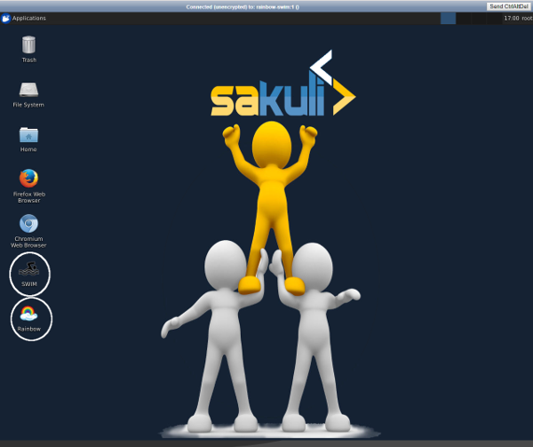
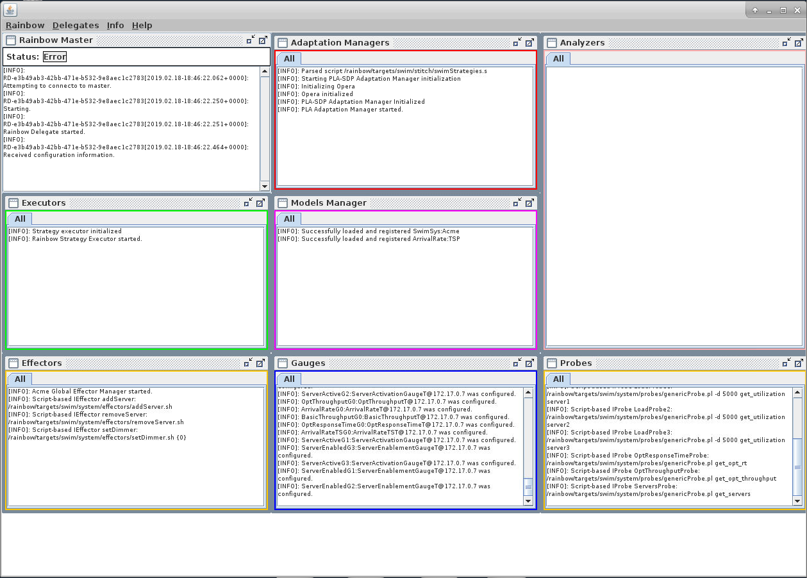
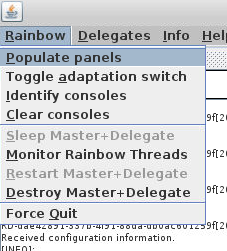
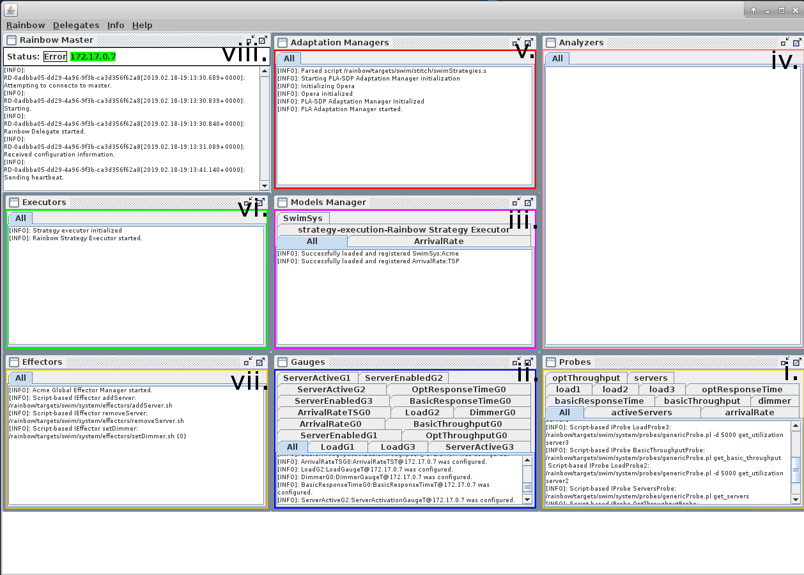

# Rainbow-SWIM example

This document provides instructions on how to build and run the docker container for a demonstration of Rainbow and SWIM.

## SWIM -  A Simulator of Web Infrastructure and Management

SWIM is a self-adaptive exemplar that simulates a web application. SWIM can be used as a target system with an external adaptation manager interacting with it through its TCP-based interface or with an adaptation manager built as a simulation module. More details can be found on [the SWIM website](https://hub.docker.com/r/gabrielmoreno/swim). 

This demonstration uses the SWIM simulator with Rainbow as the Self-Adaptive Platform

## Building SWIM-Rainbow

In the root Rainbow directory (i.e., the one that contains `deployments`, `libs`, `rainbow` etc., build the docker image using the following command:

```
> docker build -t rainbow-swim -f deployments/rainbow-swim/Dockerfile-swim .
```

This is a multi-stage docker build file that will first build a Rainbow release targeted for SWIM and (currently) using the predictive latency-aware (PLA) version of Rainbow described in [''Flexible and Efficient Decision-Making for Proactive Latency-Aware Self-Adaptation''](http://acme.able.cs.cmu.edu/pubs/show.php?id=544).

## Running Rainbow and SWIM

1. Run the docker container: 
   ```   
   > docker run -it --rm -p 6901:6901 --hostname rainbow-swim rainbow-swim
   ```
2. Log into the docker container from a browser by connecting to `http://localhost:6901` (assuming you are connecting from the Docker host). You will be prompted for a password. Use `vncpassword`. After logging in, the screen should look like:

   

3. To start SWIM, double-click the SWIM logo: . This starts the web simulation running with three initial servers responding to the Trace 1.

4. To start Rainbow, double-click on the Rainbow logo: . This will bring up the Rainbow UI, which should look like:

   

   Once Rainbow has finished starting up, it will populate the various panels with more detail.

   

   The Rainbow UI window is divided into eight separate panels. These panels are enumerated below:

   

   1. **Probe Panel**: This panel displays probe data from each probe in the system. Each probe has its own tab; the _All_ tab prints the log information from every probe.
   2. **Gauge Panel**: Gauges in Rainbow take system information emitted from probes, and converts them into model information in the form of operations on those models. The _All_ panel displays log information. Each other tab represents the operations that are emitted from the gauge and sent to the Models Manager.
   3. **Models Manager**: The Models Manager manages operations on the models represented in Rainbow, that are used to reason about adaptations on the system. Each tab is a separate model, organzed as a table of model operations that have been executed.
   4. **Analyzers**: Represents the elements that analyze the model and synthesize them to either detect errors or opportunities for adaptation. The log information from each analyzer is organized as a tab. (In this demo, the analyzer and adaptation manager are fused, and so Rainbow does not have any analyzer.)
   5. **Adaptation Managers**: This panel shows all the elements that make the decision about what adaptation to do. If there is only one adaptation manager (the norm), then all the information will be displayed in the _All_ tab.
   6. **Executors**: This panel has output from components that manage the execution of adaptations strategies that are chosen by an adaptation manager.
   7. **Effectors**: This panel displays output from effectors.
   8. **Rainbow Master**: This panel displays health and output about Rainbow generally. In this demo, the output is about heartbeat information from Rainbow to the manager.

5. In this demonstrator, probes are started automatically, and so SWIM needs to be running before Rainbow is started. If not, errors will appear in the various panels because the probes will not be able to connect to SWIM.

There is not much feedback from SWIM about what it is doing, but you should see probes, gauges, and the model changing. Initially, the adaptation manager will decide that there are too many servers given the current predicted load, and so will scale back by removing servers. You should see the removeServer effector firing eventually.

